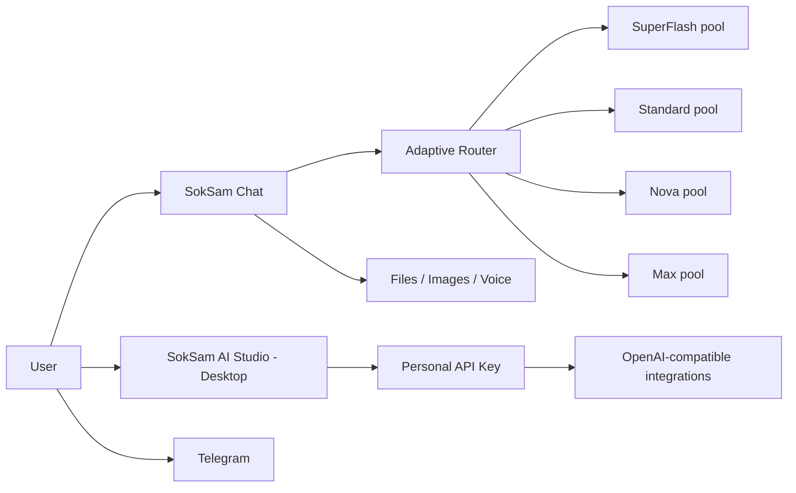

  

# SokSam AI

**A multilingual AI workspace for chat, files, images, voice, projects and developer workflows.**

 

---

## What is SokSam AI?

**SokSam AI** is an artificial intelligence workspace for conversations, supported files, image understanding, image generation, voice generation, organized project work and developer workflows.

This repository is the **official public GitHub repository for SokSam AI**. It contains product information, public architecture notes, documentation links, security guidance and issue reporting. The proprietary production application source code and private infrastructure are not published here.

> **Current status:** SokSam AI is in a **deep public demo / rapid-development stage**. The product is already usable, but it is still evolving quickly and is expected to receive substantial updates approximately every week. Interfaces, limits, model availability and pricing may change while the platform matures.

## At a glance

| Capability | What it provides |
|---|---|
| 🌍 **30 interface languages** | A multilingual product experience |
| 🧠 **~50-model adaptive backend pool** | Eligible models are selected dynamically according to tier, workload and availability |
| ⚡ **4 public chat tiers** | SuperFlash, Standard, Nova and Max |
| 📎 **File analysis** | Work with supported documents and files |
| 👁️ **Image understanding** | Analyze visual source material |
| 🎨 **Image generation** | Create images from written ideas |
| 🔊 **Voice generation** | Generate spoken audio from text in multiple languages, including Russian |
| 🗂️ **Projects & memory tools** | Projects, branches, bookmarks and explicit memory |
| 🌐 **Browser + Telegram** | Access through the web and Telegram |
| 🧩 **SokSam AI Studio** | Desktop-only API workspace with OpenAI-compatible integration |

---

## Adaptive model routing

SokSam AI does not expose one fixed backend model for every request. The production platform currently works with a pool of **around 50 eligible underlying models** distributed across the public SokSam tiers.

Routing is adaptive rather than random. The system can take into account the selected public tier, current traffic, model availability and workload distribution. A user can remain on the same eligible model for several consecutive requests — especially when traffic is low — while additional users and higher concurrency can cause the router to distribute work across other models in the same tier.

In practice this means that the backend model does **not** have to change on every message, but it can change dynamically as the service balances demand. The public contract remains stable: users choose a SokSam tier, while the internal routing layer decides which eligible backend model should serve the request.

Read more in [`docs/ADAPTIVE-ROUTING.md`](docs/ADAPTIVE-ROUTING.md).

## Public chat tiers

| Tier | Primary goal |
|---|---|
| **SokSam SuperFlash** | Very fast responses and lightweight tasks |
| **SokSam Standard** | Balanced everyday work |
| **SokSam Nova** | Deeper and more demanding tasks |
| **SokSam Max** | Highest-capability workloads |

The public tier names stay stable even when the private backend model selected inside a tier changes.

---

## SokSam AI Studio

**SokSam AI Studio** is the developer workspace for using SokSam through API keys and OpenAI-compatible integrations.

➡️ **Studio:** https://soksam.pp.ua/soksam/studio

> **Desktop availability:** SokSam AI Studio is currently available **only on computers / desktop browsers**. The regular SokSam chat remains available separately on supported devices.

Studio currently provides:

- creation and management of personal SokSam API keys;
- an **OpenAI-compatible** integration flow and base URL information inside Studio;
- the ability to connect SokSam API keys to applications and tools that support compatible API endpoints;
- usage and balance information;
- a **$5 starting test balance** for new Studio usage;
- eight Studio model choices spanning speed, balance and maximum-capability workloads.

### Studio model lineup

1. **SokSam SuperFlash**
2. **SokSam Standard Minimum**
3. **SokSam Standard Maximum**
4. **SokSam Nova Minimum**
5. **SokSam Nova Maximum**
6. **SokSam Max Minimum**
7. **SokSam Max Medium**
8. **SokSam Max Maximum / High**

At the moment, **Free is the only available subscription tier**. Paid subscriptions are not implemented yet. The Studio model catalog, limits, pricing and naming may evolve during the deep-demo period.

Full public notes: [`docs/STUDIO.md`](docs/STUDIO.md).

---

## Voice generation

SokSam AI now includes a text-to-speech / voice-generation workflow.

Enable the voice-generation function, enter text of up to **500 characters**, choose or use the available language/voice option, and SokSam returns generated spoken audio. Voice generation supports multiple languages, including **Russian**.

This feature is part of the actively evolving demo and may gain additional voices, languages and controls over time.

See [`docs/VOICE.md`](docs/VOICE.md).

---

## How the public product fits together

This diagram is intentionally conceptual. Private provider identities, credentials, routing weights and infrastructure topology are not published.

---

## Documentation in this repository

| Document | Purpose |
|---|---|
| [`docs/CURRENT-STATUS.md`](docs/CURRENT-STATUS.md) | Current deep-demo status and update cadence |
| [`docs/ADAPTIVE-ROUTING.md`](docs/ADAPTIVE-ROUTING.md) | How the ~50-model adaptive pool behaves publicly |
| [`docs/MODELS.md`](docs/MODELS.md) | Public tiers and Studio model lineup |
| [`docs/STUDIO.md`](docs/STUDIO.md) | Studio, API keys, starting balance and desktop availability |
| [`docs/VOICE.md`](docs/VOICE.md) | Voice generation and current 500-character limit |
| [`docs/ARCHITECTURE.md`](docs/ARCHITECTURE.md) | High-level public architecture |
| [`docs/BRAND.md`](docs/BRAND.md) | Official SokSam AI identity |
| [`docs/OFFICIAL-LINKS.md`](docs/OFFICIAL-LINKS.md) | First-party links |
| [`SECURITY.md`](SECURITY.md) | Security and reporting guidance |

---

## Explore SokSam AI

- 🌐 [Official website](https://soksam.pp.ua/)
- 💬 [Open SokSam AI](https://soksam.pp.ua/soksam/chat)
- 🧩 [SokSam AI Studio — desktop only](https://soksam.pp.ua/soksam/studio)
- ✨ [Features](https://soksam.pp.ua/features)
- 🧠 [Model tiers](https://soksam.pp.ua/models)
- 📚 [Documentation](https://soksam.pp.ua/docs)
- 📰 [Changelog](https://soksam.pp.ua/changelog)
- 🔐 [Security](https://soksam.pp.ua/security)
- 🛡️ [Privacy](https://soksam.pp.ua/privacy)
- 🛰️ [Telegram](https://t.me/soksamhelper_bot)
- 📡 [RSS feed](https://soksam.pp.ua/feed.xml)

More first-party links are collected in [`docs/OFFICIAL-LINKS.md`](docs/OFFICIAL-LINKS.md).

## Privacy and security

Private chats, account pages, administration routes and Studio data are deliberately kept outside the public website sitemap and search indexing.

Never post passwords, API keys, tokens, private conversations, personal data, infrastructure secrets or security vulnerabilities in a public GitHub issue.

See [`SECURITY.md`](SECURITY.md) for reporting guidance.

## Issues and feedback

GitHub Issues are intended for reproducible public product bugs, documentation corrections, broken public links, accessibility feedback and clear public feature feedback.

Do not use public issues for credentials, account-specific private information, private conversation content or vulnerability details.

---

  <strong>SokSam AI</strong> 
  Chat · Explore · Create · Build
    
  <a href="https://soksam.pp.ua/">Website</a> ·
  <a href="https://soksam.pp.ua/soksam/studio">Studio</a> ·
  <a href="https://soksam.pp.ua/docs">Docs</a> ·
  <a href="https://soksam.pp.ua/changelog">Changelog</a> ·
  <a href="https://t.me/soksamhelper_bot">Telegram</a>
    
  © 2026 SokSam AI. All rights reserved.

