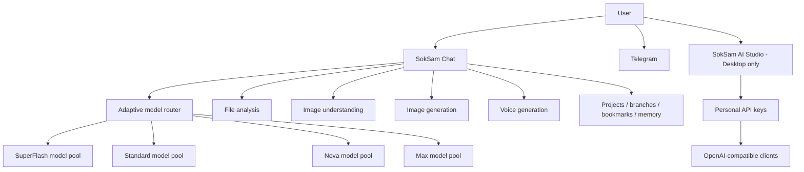

# SokSam AI public architecture

This page describes the public product architecture at a high level without exposing private infrastructure or provider-specific secrets.

## Model layer

SokSam currently operates with a backend pool of around 50 eligible models. The public router maps user traffic to eligible routes inside SuperFlash, Standard, Nova and Max.

A user can remain on the same route for multiple requests. As traffic, availability or workload changes, the router can distribute users across other eligible routes.

## Studio layer

SokSam AI Studio is currently a **desktop-only** developer workspace. It provides API-key management, model selection, balance information and OpenAI-compatible integration details.

## Media layer

The public product includes file workflows, image understanding, image generation and text-to-speech voice generation. Voice requests currently accept up to 500 characters per generation request.

## What this document intentionally does not disclose

The following remain private:

- provider credentials;
- API secrets;
- private provider model identities where not publicly exposed;
- routing weights;
- fallback topology;
- production host details;
- private databases and account data;
- internal administration systems.

This separation allows the public architecture to be understandable without weakening the security of the production service.
